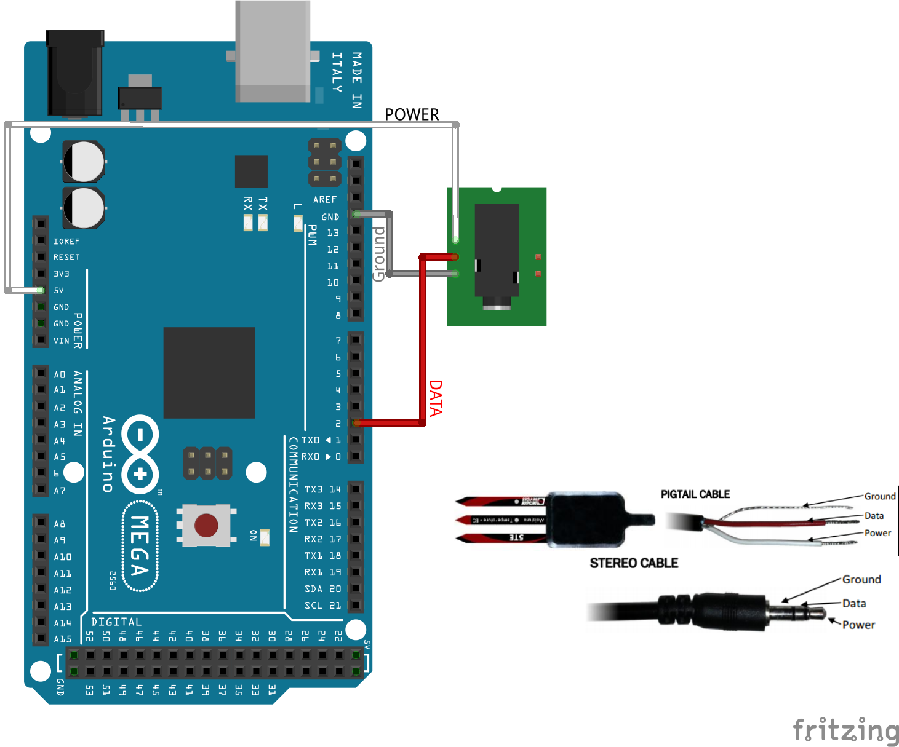

SDISerial 
=========

An SDI-12 Serial Library for Arduino.

This library was designed around filling a niche that was lacking and allow Arduino boards to communicate freely with SDI-12 Serial peripherals.  It is largely based off of the Arduino SoftwareSerial Library, modified to support the SDI12-Serial Specifications.

Works flawlessly with an assortment of [Decagon Devices Soil Moisture Sensors.](http://www.decagon.com/products/soils/)

Verified for the following boards: 
   - [Arduino UNO](http://arduino.cc/en/Main/arduinoBoardUno)
   - [Arduino MEGA2560](http://arduino.cc/en/Main/ArduinoBoardMega2560)

This is currently untested with more than two addressable devices on the sdi-bus, although I would fully expect it to work for N devices.  hopefully I will have time soon to try it with more devices on the serial bus.

INSTALLATION
------------
###Option 1: Git checkout###
1. Open your terminal and cd to your root arduino folder
	- I use `cd C:\Arduino\arduino-1.0\`
	- you will know your in the right place because it will contain "arduino.exe"
2. Change to your libraries folder `cd libraries`
3. Clone the git repository `git clone git@github.com:joranbeasley/SDISerial.git`
	
###Option 2: Zip File###
1. Download Zipfile from link on the right
2. Unzip to the libraries folder listed above
3. Rename the extracted folder from `SDISerial-Master` to `SDISerial`
	
INSTALATION VERIFICATION
------------------------
1. Open The Arduino IDE by running `arduino.exe` in the <Arduino_Root> folder.
2. Goto File > Examples > SDISerial > SDISerialExample

The wiring for the example program is 

*note*:Depending on the sensor used you may need more than 5V, for Decagon Sensors 5V should be sufficient.

DOCUMENTATION
-------------


Simple Example
-------------------
This library was designed with ease of use in mind.  Here is a simple example program to get you started. 

for more info see the included examples
```c++

#include <SDISerial.h>
#include <string.h>
#define DATA_PIN 2
SDISerial connection(DATA_PIN);
char output_buffer[125]; // just for uart prints
char tmp_buffer[4];

//initialize variables
void setup(){
      connection.begin();
      Serial.begin(9600);//so we can print to standard uart
      //small delay to let the sensor do its startup stuff
      delay(3000);//3 seconds should be more than enough
}

//main loop
void loop(){
    //print to uart
    Serial.println("Begin Command: ?M!");
    
    //send measurement query (M) to the first device on our bus
    char* resp = connection.sdi_query("?M!",1000);//1 second timeout
    //this really just returns a message that tells you the maximum wait before the measurement is ready
    
    sprintf(output_buffer,"RECV: %s",resp?resp:"No Response Recieved!!");
    Serial.println(output_buffer);
    delay(10000);//sleep for 10 seconds before the next read
}
```
